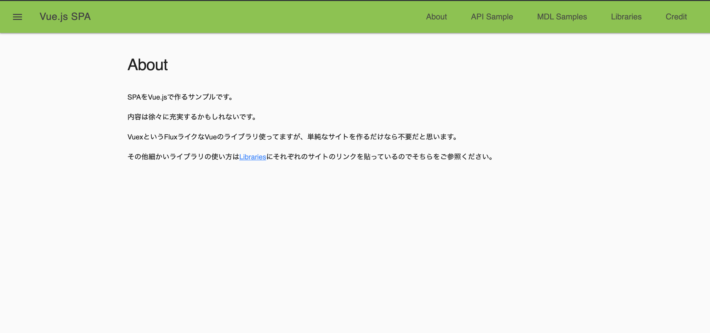
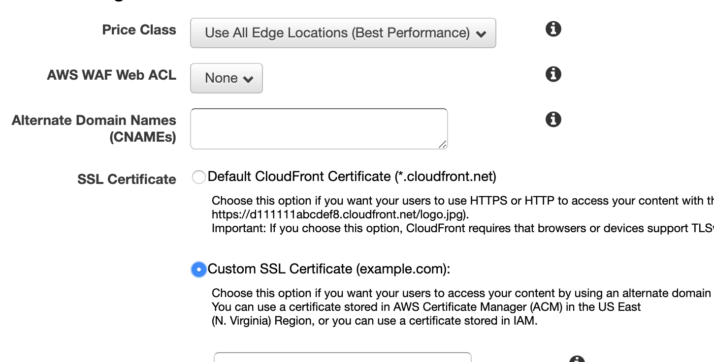

## フロントエンドの勉強に個人ブログを安価な構成でつくりたい

@3to_day

on shinjuku mokumoku programming #72

---

## Who

スマートスピーカー内部の開発/AWS サーバレスの開発

---

## 今日やること

- 限りなくやすい構成で投稿を継続したくなるブログを作る
 * 開始前
 
 　　
   
   * Cloudfront - S3でSPAを載せただけ

---
 * やること
   * https化
   * ドメイン設定
   * サブドメイン作成
   * ブログっぽくする
   * 投稿できるようにする
   * 初投稿する
   * 写真を簡単に載せられるようにする。
   * 動画を載せられるようにする。
   * Google Analyticsの設定など

---

## できたこと
   * https化
   * ドメイン設定
   * サブドメイン作成

---
## 辛かったこと
* 何度画面更新しても選択できなかったがサインアウトすると選択可能に
 * 

---
* nodebrewが入っている環境にhomebrewでyarnを入れると、アプリが動かなくなった
  https://hisa-tech.site/yarn-install-stumble/
 
---
* Markdownを書けるようにしたいが、できない (v-htmlタグが読み込まれていない？)
  https://qiita.com/seigo-pon/items/d2695e830e234b02cdbe

---

## About
## blackbox exporter task

---

## まとめ
* かなり集中できた。
* Vueに少しだけ触れることができた。
* 3年前のリポジトリをフォークしているので、少しバージョンが古いのが気になる

---

## 次回以降
* Markdownを投稿できるようにする

